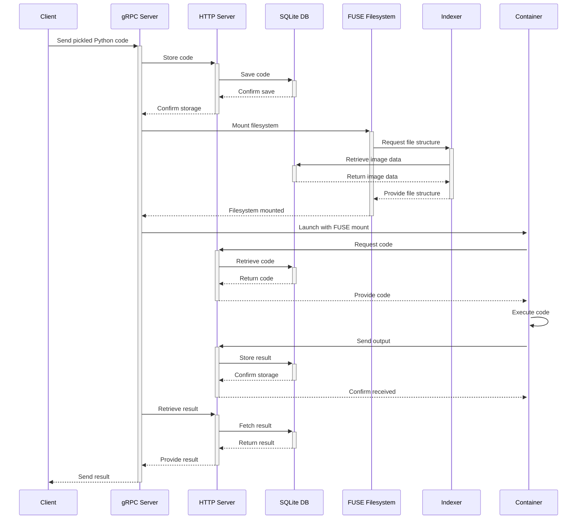
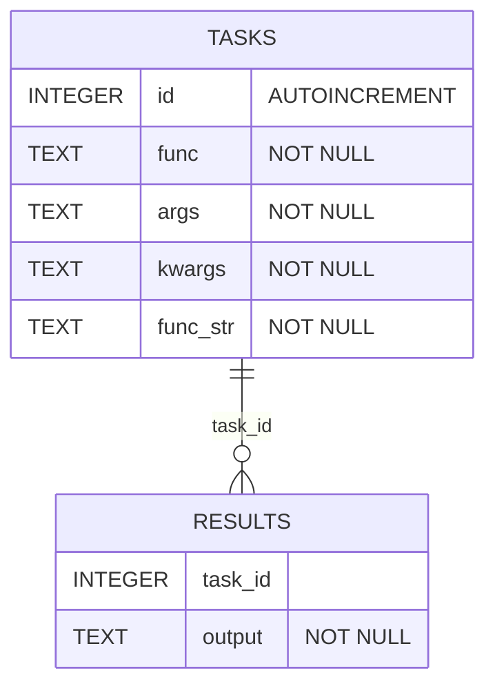
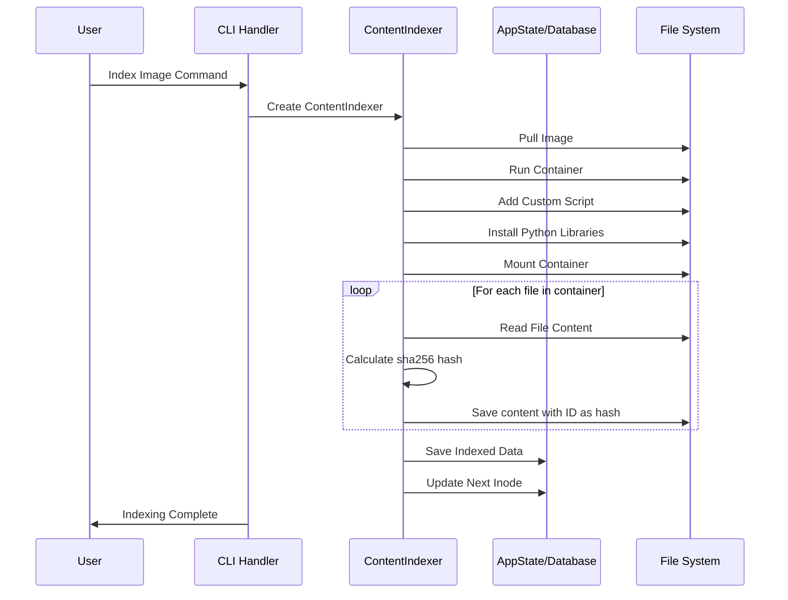
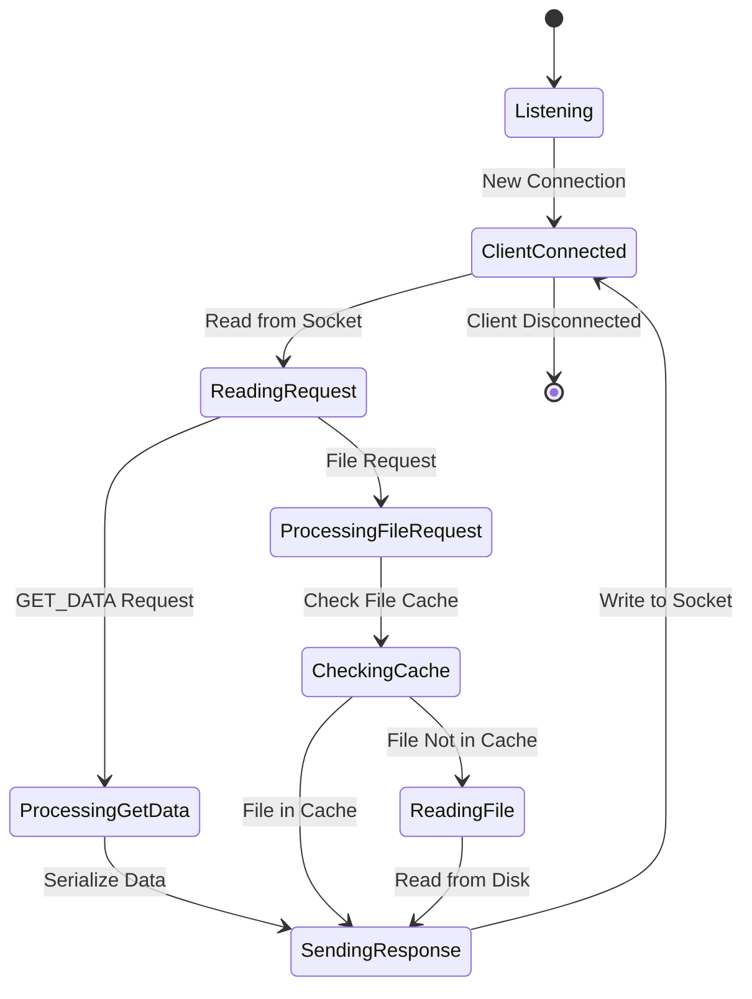

## Exploring the Next Generation of Serverless Platforms

## Introduction

Silo is an exploration into understanding how modern infrastructure developed by [Modal Labs](https://modal.com/) and [similar](https://www.beam.cloud/) startups work. The primary goal is to create a platform with extremely fast build times, cold boot times ranging from a couple of seconds to hundreds of milliseconds, and an extremely cheap solution for serverless computing.

I learned a lot of initial concepts from the [Modal Labs Deep Dive](https://ehsanmkermani.com/2023/12/08/modal-labs-deep-dive/) blog post by [Ehsan](https://ehsanmkermani.com/) and [twitter thread](https://x.com/bernhardsson/status/1545399534980931584) by founder and CEO of Modal Labs, [Erik Bernhardsson](https://erikbern.com/).

This post covers key workings and components of the Silo architecture and how they work together to provide a fast and efficient serverless platform.

## Why

Currently, methods of pulling and launching containers are slow; pulling an entire image can take from tens of seconds to minutes, depending on the size. Building them can take similar or even longer depending on the cache. All of this adds up the cost of the cloud infrastructure and thus to the end user.

It also slows down the development process and makes it harder to iterate on the code. Low latency in development is extremely important as emphasized in this great talk by [Bret Victor - Inventing on Principle.](https://www.youtube.com/watch?v=PUv66718DII)

## Solution

One of the solution to this problem is best explained in this [Twitter thread](https://x.com/bernhardsson/status/1545399534980931584) by Erik Bernhardsson, but in short, we take advantage of 4 different facts:

1. File-based Linux Structure: Almost everything is a file in Linux and the average file size in Linux is often less than an MB.
2. Selective File Usage: We rarely need the entire image; a few specific files are used most of the time.
3. We can mount a container image as a filesystem. e.g. In Podman we can use the `--rootfs` flag to mount the image as a filesystem.
4. Most of the files are identical across containers. such as Python standard library, numpy, pandas etc.

By using these facts and implementing caching techniques, we can significantly reduce cold boot times from tens of seconds to just hundreds of milliseconds.

## Quick Start

To try Silo on your local machine, install [podman](https://podman.io/), then follow these steps:

1. Start the Indexer to index images ( requires root permissions ):

   ```bash
   $ cargo build --release --bin indexer
   $ sudo RUST_LOG=info ./target/release/indexer
   ```

   A command-line interface will appear, allowing you to index images and list indexed images.
   Index an image using: `index python:3.11` (substitute `python:3.11` with your python version)

   Keep the Indexer running in the background.

2. Start the Silo server:
   ```bash
   cargo run --release --bin silo -- serve
   ```

2. Launch a sample Python script:

   ```bash
   python silo/cli.py launch examples/hello.py
   ```

## Architecture Overview

Silo's architecture is composed of mainly four components:

1. [gRPC Server](./src/grpc.rs) - The main server that manages the entire lifecycle from client request to response.
2. [HTTP Server](./src/http.rs) - Acts as a communication bridge between the gRPC server and the containers to send and receive data.
3. [FUSE Filesystem](./src/filesystem/silofs.rs) - Mounts a read-only filesystem for containers to access image files.
4. [Indexer](./src/indexer/server.rs) - Manages container images, serving container files via a TCP server to the FUSE filesystem.

Here's the detailed lifecycle for a user request in Silo:



### gRPC Server

[grpc.rs](./src/grpc.rs)

The gRPC server is the heart of Silo, managing the entire lifecycle of container execution. Here's what happens when you run a Python script through Silo:

1. The server receives pickled Python code with function parameters and image name from the client
   [silo.py](./silo/silo.py)

   ```py
   request.func_str = inspect.getsource(self.func)
   request.func = base64.b64encode(cloudpickle.dumps(self.func)).decode("utf-8")
   request.args = base64.b64encode(cloudpickle.dumps(args)).decode("utf-8")
   request.kwargs = base64.b64encode(cloudpickle.dumps(kwargs)).decode("utf-8")
   request.image_name = self.image_name
   ```

2. It communicates with the HTTP server to store the code.

   ```rs
    let task_id = reqwest::Client::new()
            .post(format!("{}/api/tasks", self.host_link))
            .json(&Task {
                id: None,
                func: request_data.func,
                args: request_data.args,
                kwargs: request_data.kwargs,
                func_str: request_data.func_str,
            })
            .send()
            .await;
   ```

3. A FUSE filesystem is mounted to provide a read-only filesystem for the container. See [fuse.rs](./src/filesystem/mount.rs)

   ```rs
   std::fs::create_dir_all(mount_path).unwrap();

   self.filesystem
       .mount(&request_data.image_name, mount_path)
       .unwrap();
   ```

4. The container is launched using Podman in [container.rs](./src/container.rs), with the FUSE filesystem mounted and running the Python script predefined in the image [silo.py](./common/silo.py).

   ```rs
       let status = Command::new("podman")
       .args(&[
           "run",
           "-e",
           &format!("HOST_LINK={}", host_link),
           "-e",
           &format!("TASK_ID={}", task_id),
           "--network",
           "host",
           "--rootfs",
           mount_path, // FUSE filesystem mount path
           "python3",
           script_path,
       ])
       .output()?;
   ```

5. Once the container completes execution, the server retrieves the output and sends it back to the client
   ```rs
        let python_result = reqwest::Client::new()
        .get(format!("{}/api/results/{}", self.host_link, task_id))
        .body(container_name)
        .send()
        .await
        .unwrap()
        .json::<Output>()
        .await
        .unwrap();
   ```

### HTTP Server

[http.rs](./src/http.rs)

The HTTP server facilitates communication between the gRPC server and the containers, using following HTTP endpoints:

```rs
web::scope("/api")
    .route("/tasks", web::post().to(add_task)) // Adding a new task
    .route("/tasks/{task_id}", web::get().to(get_task)) // Getting a task
    .route("/results/{task_id}", web::post().to(add_result)) // Adding a result
    .route("/results/{task_id}", web::get().to(get_result)) // Getting a result
```

It also stores the data in an [SQLite database](./src/db.rs).

#### Database

[db.rs](./src/db.rs)

The following SQLite database schema is used to store task and result data:



### FUSE Filesystem

[/filesystem](./src/filesystem/mount.rs)

Silo uses a FUSE (Filesystem in Userspace) filesystem to provide a read-only view of filesystem to running containers. This filesystem:

1. Is mounted on the host machine.
2. Acts as a read-only filesystem for containers.
3. Retrieves file structure and contents from the Indexer via TCP.

Our FUSE filesystem mainly implements the following methods [silofs.rs](./src/filesystem/mount.rs):

```rs
impl Filesystem for SiloFSMount {
    fn lookup(&mut self, _req: &Request, parent: u64, name: &OsStr, reply: ReplyEntry) {
        // Lookup a directory entry by name and get its attributes.
    }

    fn getattr(&mut self, _req: &Request, ino: u64, reply: ReplyAttr) {
        // Get attributes for a file or directory.
    }

    fn read(
        &mut self,
        _req: &Request,
        ino: u64,
        _fh: u64,
        offset: i64,
        size: u32,
        _flags: i32,
        _lock: Option<u64>,
        reply: ReplyData,
    ) {
        // Read data from a file.
    }

    fn open(&mut self, _req: &Request, ino: u64, _flags: i32, reply: ReplyOpen) {
        // Open a file.
    }

    fn readdir(
        &mut self,
        _req: &Request,
        ino: u64,
        _fh: u64,
        offset: i64,
        mut reply: ReplyDirectory,
    ) {
        // Read a directory.
    }

    fn readlink(&mut self, _req: &Request, ino: u64, reply: ReplyData) {
        // Read the target of a symbolic link.
    }
}
```

### Indexer

[indexer.rs](./src/indexer/indexer.rs)

The Indexer is a crucial component that serves container file data and structure and allows adding new images to the system.

#### Indexing

The indexing process is defined in [indexer.rs](./src/indexer/indexer.rs) and [commands.rs](./src/indexer/commands.rs). In short, and involves the following steps:

1. Pull the image from the container registry.
2. Run the container and mount it's filesystem in a temporary directory.
3. Iterate over each file in the container, calculate its sha256 hash, and save the content with the hash as the ID.
   1. Saving the content with the hash as the ID allows for deduplication across multiple images.
4. Save the entire filestructure in a SQLite database, implemented in [database.rs](./src/indexer/database.rs).



New images can be added to indexer via a command-line interface:

```
Available commands:
    ls              - List indexed images
    index <name>    - Index an image by name
    help            - Show this help message
```

```bash
cargo run --release --bin indexer -- index python:3.11
```

#### Serving

[server.rs](./src/indexer/server.rs)

The Indexer exposes a TCP server to serve image files to the FUSE filesystem.

1. FUSE filesystem first requests file structure from the Indexer using a very hacky way by sending a `GET_DATA` text to the Indexer.
2. The Indexer then reads the image file structure from [SQL Database](./src/indexer/database.rs) and sends it back to the FUSE filesystem.
3. The FUSE filesystem then can request individual files from the Indexer using the file sha256 hash.



## Future Improvements

While Silo is a powerful demonstration of container orchestration concepts, there's always room for improvement. Some areas we're considering for future development include:

1. **Optimized Indexing**: The indexer right now is extremely inefficient when indexing the images. It indexes the entire image and stores it in the database. This is due to mounting an entire image then interating over individual files. A more practical way would be to perhaps do a parallel layer based indexing.

2. **Enhanced Security**: Security was not the primary focus of this project, but it's an important consideration for production use. Modal seems to be using [gVisor](https://gvisor.dev/) for this purpose.

3. **Scalability Enhancements**: Silo is currently designed for single-machine use, but it could be extended to support multiple machines in a cluster. This would involve developing a distributed filesystem and load balancing.

4. **Encryption**: The communication between the gRPC server and the containers is not encrypted. This is a security risk and should be addressed.
